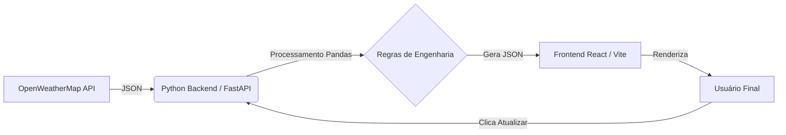

# RailTemp Monitor | Sistema de Monitoramento Térmico de Via Permanente

> **Painel de Inteligência Geoespacial para Prevenção de Acidentes Ferroviários.**

O **RailTemp Monitor** é uma solução Full Stack projetada para monitorar, prever e alertar sobre condições críticas de temperatura em trilhos ferroviários. Utilizando dados meteorológicos em tempo real e modelos de inércia térmica, o sistema identifica riscos de **Flambagem** (dilatação excessiva) e **Ruptura** (contração excessiva), permitindo que o CCO (Centro de Controle Operacional) tome decisões preventivas de manutenção.

---

## Screenshots

*(Espaço reservado: Tire prints do seu mapa no modo Dark e do painel Analytics e coloque aqui)*

| Mapa em Tempo Real (Dark Mode) | Analytics & KPIs |
| ------------------------------ | ---------------- |
|                                |                  |

---

## Funcionalidades Principais

### Visualização Geoespacial (GIS)

* **Mapa Interativo:** Renderização de centenas de pontos de monitoramento (KMs) via Leaflet.
* **Heatmap (Mapa de Calor):** Visualização de manchas térmicas para identificar corredores críticos.
* **Filtros Dinâmicos:** Foco imediato em pontos de estado "Crítico" ou "Atenção".

### Engenharia & Analytics

* **Cálculo de Temperatura do Trilho:** Modelo preditivo que correlaciona temperatura ambiente, irradiação solar e vento.
* **Regras de Via Permanente:** Algoritmo baseado na Temperatura Neutra (Tn) para definir limites de segurança.
* **Dashboard Executivo:** KPIs de média térmica, máximas registradas e distribuição de alertas.
* **Gráficos de Engenharia:** Correlação Ambiente x Trilho e Efeito de Resfriamento Eólico.

### Sistema & UX

* **Modo Noturno (Dark Mode):** Interface otimizada para operações 24h e salas de controle.
* **Exportação de Dados:** Geração de relatórios CSV instantâneos para auditoria.
* **Atualização em Tempo Real:** Pipeline de dados acionado via API (FastAPI) diretamente pela interface.

---

## Regras de Engenharia (Business Logic)

O sistema baseia-se no conceito de **Temperatura Neutra (Tn)**, assumindo um alvo de **38°C** (configurável). As faixas de operação são:

| Status              | Faixa de Temperatura       | Descrição Técnica                                                                 | Ação Recomendada                                     |
| ------------------- | -------------------------- | --------------------------------------------------------------------------------- | ---------------------------------------------------- |
| **Ideal**           | **35°C a 41°C** (Tn ± 3°C) | Tensão residual nula.                                                             | Liberado para **Solda de Fechamento**.               |
| **Atenção**         | **28°C a 50°C**            | Leve compressão ou tração.                                                        | Solda permitida apenas com **tensores hidráulicos**. |
| **Crítico (Calor)** | **> 50°C**                 | Alta compressão. Risco iminente de **Flambagem** (perda da estabilidade lateral). | **Interdição** ou restrição de velocidade.           |
| **Crítico (Frio)**  | **< 10°C**                 | Alta tração. Risco de **Ruptura** da solda ou trilho.                             | Monitoramento de trincas.                            |

---

## Arquitetura Técnica

O projeto segue uma arquitetura desacoplada (Frontend-Backend Separation):



### Stack Tecnológico

* **Backend:** Python 3, Pandas, FastAPI, Uvicorn.
* **Frontend:** React.js, Vite, Tailwind CSS, Recharts, React-Leaflet, Lucide.
* **DevOps:** GitHub Actions (CI/CD para Deploy Automático).

---

## Instalação e Execução Local

### Pré-requisitos

* Node.js (v18+)
* Python (v3.9+)

### 1. Configurar o Backend (API)

```bash
cd rail-monitor/backend

python -m venv venv
# Windows: venv\\Scripts\\activate
# Linux/Mac: source venv/bin/activate

pip install -r requirements.txt

uvicorn server:app --reload --port 8000
```

O Backend ficará rodando em `http://localhost:8000`.

### 2. Configurar o Frontend (Dashboard)

```bash
cd rail-monitor/frontend

npm install

npm run dev
```

O Frontend ficará disponível em `http://localhost:5173` (ou porta similar).

---

## Estrutura de Pastas

```text
RailTemp/
├── .github/workflows/   # Automação de Deploy (GitHub Actions)
├── rail-monitor/
│   ├── backend/
│   │   ├── data/           # Arquivos JSON/Parquet (Input/Output)
│   │   ├── rail_predictor/ # Núcleo de cálculo térmico
│   │   ├── server.py       # API FastAPI
│   │   └── main.py         # Pipeline de processamento
│   └── frontend/
│       ├── src/
│       │   ├── components/ # Sidebar, Map, Charts, Cards
│       │   ├── pages/      # MapPage, AnalyticsPage
│       │   ├── data/       # Recebe o JSON do Python
│       │   └── lib/        # Regras de negócio (rules.js)
```

---

## Como Contribuir

1. Faça um Fork do projeto.
2. Crie uma Branch para sua Feature (`git checkout -b feature/NovaFeature`).
3. Faça o Commit (`git commit -m 'Add some NovaFeature'`).
4. Faça o Push (`git push origin feature/NovaFeature`).
5. Abra um Pull Request.

---

Desenvolvido por Eric Binek
